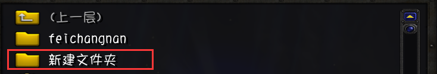

# WarcraftHelper

#### 介绍

魔兽辅助插件，解除地图大小限制，宽屏支持，解锁FPS，自动保存录像，自动显示fps，最大刷新率修复，目录中文名修复(同时也修复了一些中文名字地图的显示BUG)，自动显血



支持版本：1.20e、1.24e和1.27a

| 特性             | 1.20e | 1.24e | 1.27a |
| ---------------- | ----- | ----- | ----- |
| 解锁地图大小限制 | √     | √     | √     |
| 宽屏             | √     | √     | √     |
| 解锁fps          | √     | √     | √     |
| 自动保存录像     | √     | √     | √     |
| 自动显示fps      | ×     | √     | √     |
| 最大刷新率修复   | √     | √     | √     |
| 地图目录中文名修复   | √     | √     | √     |
| 自动显血 | √ | 游戏自带 | 游戏自带 |
| 字体重叠修复 | √ | √ | √ |

使用方法：把WarcraftHelper.mix文件直接放到魔兽目录下，第一次运行使用窗口化模式启动魔兽争霸3，以便插件覆盖注册表中魔兽fps最大值数据。


- 如果你的显示器大于1080p，产生了字体重叠问题，游戏内使用F7键可以刷新窗口，需要**窗口化模式**。


- 1.20e和1.24e魔兽**建议**打上[d3d8to9](https://github.com/crosire/d3d8to9)补丁，因为新版windows和旧版本魔兽兼容性不好，dx9可以减少卡顿感。

- 录像会自动保存在魔兽replay目录的WHReplay子目录下。

- 如果想要打开自动显示fps，需要**进入注册表**：

```
HKEY_CURRENT_USER\\SOFTWARE\\Blizzard Entertainment\\Warcraft III\\Video
```

将表项`showfps`设置为1即可，**不支持**1.20e版本魔兽，你仍然可以在游戏内使用`/fps`来关闭fps显示。

- 对于高刷新率屏幕，魔兽全屏模式下鼠标会有延迟感，第一次打开游戏时会刷新注册表，第二次进入游戏后就正常不会有延迟感了。
- 对于1.20e的版本，如果要开启自动显血，需要**进入注册表**：

```
HKEY_CURRENT_USER\\SOFTWARE\\Blizzard Entertainment\\Warcraft III\\Gameplay
```

将表项`healthbars`设置为1即可，**支持**1.20e版本魔兽。


#### 参考项目

[YDWE](https://github.com/actboy168/YDWE)

[RenderEdge](https://github.com/ENAleksey/RenderEdge_Widescreen)

